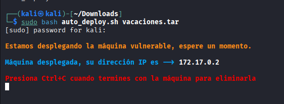
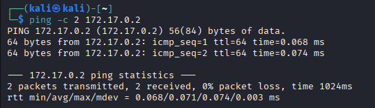
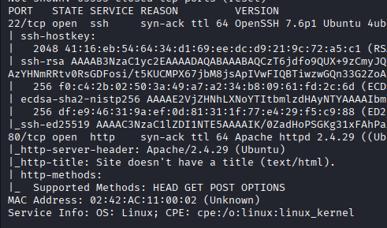
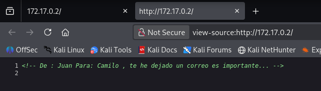
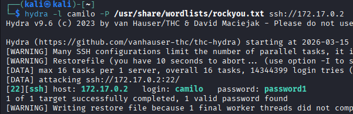
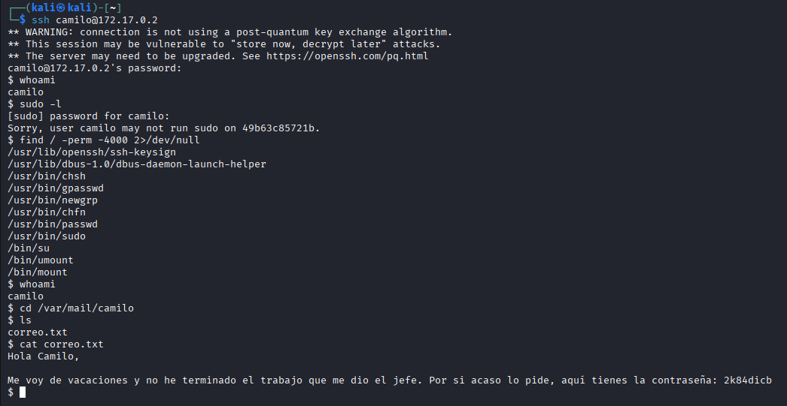
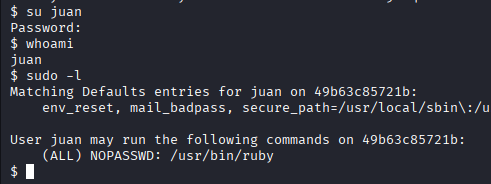
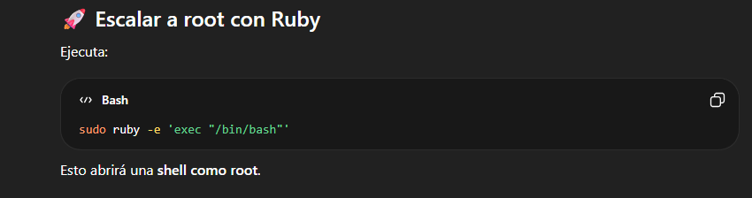
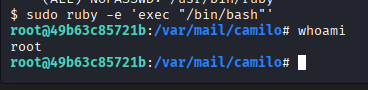

# Vacaciones 🏖️
  

## 📄 Información general 📝
- 🖥️ **Máquina:** Vacaciones  
- 🏫 **Plataforma:** DockerLabs  
- 📊 **Dificultad:** Muy fácil ⭐  
- 🎯 **Objetivo:** Comprometer la máquina objetivo mediante técnicas básicas de **pentesting** 🕵️‍♂️💥.  
- 🧪 **Tipo de laboratorio:** Laboratorio práctico para entrenamiento en **ciberseguridad ofensiva** 🛡️⚔️.  
- 🐧 **Sistema operativo:** Probablemente **Linux** 🐚 (según TTL).  
- 🧠 **Metodología:** Reconocimiento 🔎, enumeración 📡, explotación 💣 y escalada de privilegios 🔐👑.  

---

# 🧠 Fases de Pentesting 🔄
- 🔎 **Reconocimiento**  
- 📡 **Enumeración**  
- 💥 **Explotación**  
- 🔐 **Escalada de privilegios**  
- 📝 **Post-explotación**  

---

## 🔎 Reconocimiento
  
Se analiza la máquina **Vacaciones**, clasificada como **muy fácil** ⭐ en **DockerLabs**, diseñada para practicar técnicas de **pentesting** 🕵️‍♀️ y **ciberseguridad ofensiva** 🛡️.  

  
Se realiza un **ping** 🖧 para verificar conectividad. El host responde ✅ y el TTL = 64 sugiere que el sistema es **Linux** 🐧.  

---

## 📡 Enumeración
  
Se ejecuta **Nmap** 📡 para identificar puertos y servicios. Se detectan:  
- **22/tcp (SSH)** 🔑  
- **80/tcp (HTTP)** 🌐  

  
Se accede al navegador web 🌐. La página parece **vacía** ❌, pero inspeccionando el código fuente 📝 se encuentra:  

!-- De: Juan Para: Camilo, te he dejado un correo, es importante... -->

Se **guarda este mensaje** para explotación futura 💡.  

---

## 💥 Explotación
  
Se realiza **fuerza bruta con Hydra** 💣 usando el usuario **camilo**:  
- **Usuario:** camilo  
- **Contraseña:** password1 ✅  

Esto permite **acceder vía SSH** 🖧 al sistema y obtener **acceso inicial** 💻.  

  
Dentro del sistema:  

sudo -l

- Resultado: **camilo no tiene permisos sudo** ❌  
- Se buscan binarios SUID 🔑, pero **ninguno es explotable** ❌  
- Se recuerda el comentario en el código web y se revisa `/var/mail/camilo` 📂  

Mensaje encontrado:  

"Me voy de vacaciones y no he terminado el trabajo que me dio el jefe. Por si acaso lo pide, aquí tienes la contraseña: 2k84dicb"

Contraseña relevante para **acceder a otro usuario** 🔑.  

---

## 🔐 Escalada de privilegios
  
Cambio de usuario:  

su juan

- Contraseña: **2k84dicb** ✅  
- Verificación sudo:  

sudo -l

Resultado:  

(ALL) NOPASSWD: /usr/bin/ruby 💎

Usuario **juan** puede ejecutar Ruby como **root** 👑 sin contraseña, representando **vector de escalada** ⚡.  

  
Se investiga cómo usar Ruby 🐍💎 para obtener **shell con privilegios root** 🏆 y ejecutar comandos del sistema 🖥️.  

  
Se ejecuta el **comando de Ruby con sudo** ⚡💻. Comprobación:  

whoami

Resultado:  

root 👑✅

Escalada de privilegios exitosa, control total sobre la máquina 💪🖥️.  

---

# 🧰 Herramientas utilizadas 🛠️
- 🐧 **Kali Linux**  
- 📡 **Nmap** — Escaneo de puertos y servicios  
- 🌐 **Navegador Web** — Enumeración HTTP  
- 💣 **Hydra** — Fuerza bruta SSH  
- 🔑 **SSH** — Acceso remoto  
- 📂 **Comandos de Linux** — Enumeración interna  
- 💎 **Ruby** — Escalada de privilegios  

---

# 🛡️ Recomendaciones de seguridad ⚠️
- 🔐 Evitar **contraseñas débiles** 💥🔑  
- 🚫 Deshabilitar **autenticación por contraseña SSH**, usar **claves públicas** 🗝️  
- 📁 Restringir acceso a archivos sensibles `/var/mail/`  
- 🔎 Auditar permisos de **sudo** regularmente ⚠️  
- ⚠️ No permitir intérpretes (ruby, python, bash, perl) con **privilegios elevados**  
- 🧹 Eliminar **comentarios sensibles en código fuente web** 📝❌  

---

# 📌 Conclusión 🏁
Este laboratorio muestra cómo **pequeñas filtraciones** 💡 combinadas pueden comprometer todo un sistema 🖥️💥:  
- Enumeración web 🌐 → comentario oculto → correo interno 📨  
- Acceso a usuario secundario 🔑  
- Configuración insegura sudo 💎 → ejecución Ruby → **root** 👑  

Resalta la importancia de aplicar **buenas prácticas de seguridad** 🛡️, auditorías periódicas y proteger información sensible 🚫📂.  

---

🐱‍💻 *Write-up con fines educativos para práctica de pentesting en DockerLabs.*
